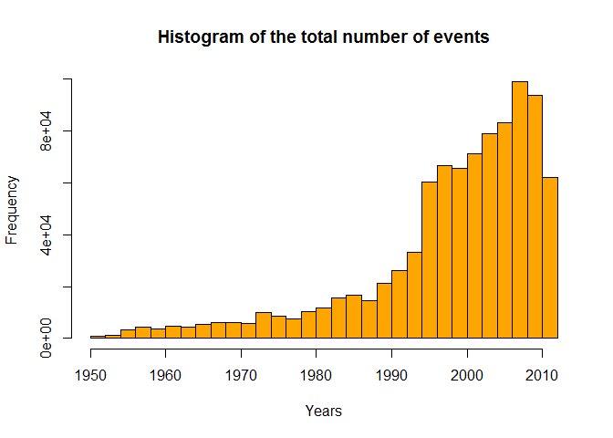
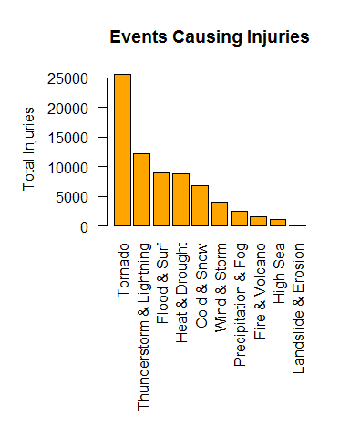
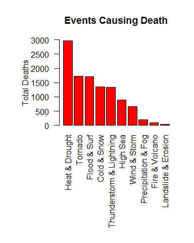
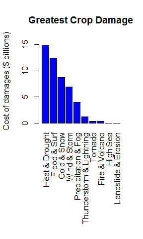
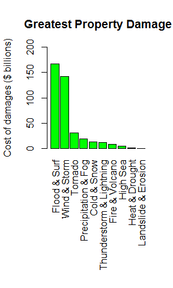
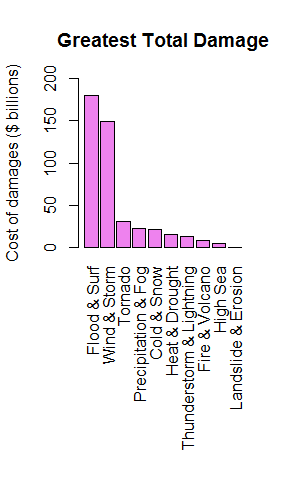

# Impact of Weather Events on Public Health and Economy in the United States
Michał Maliszewski  
16 stycznia 2016  

## Synopsis

In this report, the goal is to analyze the impact of different weather events on public health and economy based on the storm database collected from the U.S. National Oceanic and Atmospheric Administration’s (NOAA) during the years 1950 - 2012. The data used will be estimates of fatalities, injuries, property, crop and total damage to decide which types of event are most harmful to the population health and economy. My results shows that:

* Heat, Tornado and Flood cause the most deaths.
* Tornado, Lighting and Flood cause the most injuries.
* Flood, Wind and Storm have the highest economical impact.

## Questions

Your data analysis must address the following questions:

1. Across the United States, which types of events (as indicated in the EVTYPE variable) are most harmful with respect to population health?
2. Across the United States, which types of events have the greatest economic consequences?

## Data Processing

Our first step will be to load the *.csv file. I assume that the data were before downloaded and unziped. In case of problems with getting the data, it can be downloaded from my GitHub repository (unziped) : 


```r
#Reading the *.csv
rawStormData <- read.csv("repdata-data-StormData.csv")

#Check the number of attributes and rows
dim(rawStormData)
```

```
## [1] 902297     37
```

To simplify our data set I'm creating additional attribiute which will be Year Number from BGN_DATE attribute.


```r
#Adding year attribuite which is equals to BGN_DATE year part
rawStormData$year <- as.numeric(format(as.Date(rawStormData$BGN_DATE, format = "%m/%d/%Y %H:%M:%S"), "%Y"))
```

Now it's time to plot the histogram of raw data set.


```r
#Draw a histogram
hist(rawStormData$year, main="Histogram of the total number of events", xlab="Years", col="orange", breaks=seq(from=1950, to=2012, by=2))
```

 

As we can see, the number of event have been growing since 1990. The highest values start from 1995, however value from 2011 can suggest that we achieved local maximum of events. In case of that, I decided to take to next step only years > 1990. Additionally we don't need to use all the data attribiutes in rawStormData set.

```r
#Takes the data only in [1991 - 2012]
shortStormData <- rawStormData[rawStormData$year > 1990, ]

#Select necessary attributes
neededColumns <- c("BGN_DATE", "EVTYPE", "FATALITIES", "INJURIES", "PROPDMG", "PROPDMGEXP", "CROPDMG", "CROPDMGEXP", "year")

#Reduce the number of the data
reducedStormData <- shortStormData[, neededColumns]

#Rename attributes
names(reducedStormData) <- c("BGN_DATE", "EVTYPE", "FATALITIES", "INJURIES", "PROPDMG", "PROPDMGEXP", "CROPDMG", "CROPDMGEXP", "YEAR")

#See the result
head(reducedStormData)
```

```
##               BGN_DATE    EVTYPE FATALITIES INJURIES PROPDMG PROPDMGEXP
## 4845 1/10/1991 0:00:00 TSTM WIND          0        0       0           
## 4846 2/13/1991 0:00:00      HAIL          0        0       0           
## 4847 2/13/1991 0:00:00      HAIL          0        0       0           
## 4848 2/13/1991 0:00:00 TSTM WIND          0        0       0           
## 4849 2/13/1991 0:00:00      HAIL          0        0       0           
## 4850 2/19/1991 0:00:00 TSTM WIND          0        0       0           
##      CROPDMG CROPDMGEXP YEAR
## 4845       0            1991
## 4846       0            1991
## 4847       0            1991
## 4848       0            1991
## 4849       0            1991
## 4850       0            1991
```

Now it is time to group the event attribiute.

```r
#Find unique values
uniqueValues <- unique(reducedStormData$EVTYPE)

#Result
head(uniqueValues)
```

```
## [1] TSTM WIND             HAIL                  TORNADO              
## [4] FREEZING RAIN         SNOW                  ICE STORM/FLASH FLOOD
## 985 Levels:    HIGH SURF ADVISORY  COASTAL FLOOD ... WND
```

So there are 985 unique values.I decided to group them into a 10, most popular (in my opinion) categories. The new attribute will be created.

```r
#Grouping by key words. Consider, that the order of this operations is important
reducedStormData[grepl("precipitation|rain|hail|drizzle|wet|percip|burst|depression|fog|wall cloud", reducedStormData$EVTYPE, ignore.case = TRUE), "damageSource"] <- "Precipitation & Fog"
reducedStormData[grepl("wind|storm|wnd|hurricane|typhoon", reducedStormData$EVTYPE, ignore.case = TRUE), "damageSource"] <- "Wind & Storm"
reducedStormData[grepl("slide|erosion|slump", reducedStormData$EVTYPE, ignore.case = TRUE), "damageSource"] <- "Landslide & Erosion"
reducedStormData[grepl("warmth|warm|heat|dry|hot|drought|thermia|temperature record|record temperature|record high", reducedStormData$EVTYPE, ignore.case = TRUE), "damageSource"] <- "Heat & Drought"
reducedStormData[grepl("cold|cool|ice|icy|frost|freeze|snow|winter|wintry|wintery|blizzard|chill|freezing|avalanche|glaze|sleet", reducedStormData$EVTYPE, ignore.case = TRUE), "damageSource"] <- "Cold & Snow"
reducedStormData[grepl("flood|surf|blow-out|swells|fld|dam break", reducedStormData$EVTYPE, ignore.case = TRUE), "damageSource"] <- "Flood & Surf"
reducedStormData[grepl("seas|high water|tide|tsunami|wave|current|marine|drowning", reducedStormData$EVTYPE, ignore.case = TRUE), "damageSource"] <- "High Sea"
reducedStormData[grepl("tstm|thunderstorm|lightning", reducedStormData$EVTYPE, ignore.case = TRUE), "damageSource"] <- "Lightning"
reducedStormData[grepl("tornado|spout|funnel|whirlwind", reducedStormData$EVTYPE, ignore.case = TRUE), "damageSource"] <- "Tornado"
reducedStormData[grepl("fire|smoke|volcanic", reducedStormData$EVTYPE, ignore.case = TRUE), "damageSource"] <- "Fire & Volcano"
reducedStormData <- reducedStormData[complete.cases(reducedStormData[, "damageSource"]), ]

#Rename attributes
names(reducedStormData) <- c("BGN_DATE", "EVTYPE", "FATALITIES", "INJURIES", "PROPDMG", "PROPDMGEXP", "CROPDMG", "CROPDMGEXP", "YEAR", "DMG_SRC")

#Change to a factor for future use
reducedStormData$DMG_SRC <- as.factor(reducedStormData$DMG_SRC)
```

## Impact on population health

Before we start calculations, some sort function will be needed (it will additionally sum the values). I wrote one:

```r
sorter <- function(fieldName, dataset = stormData) {
     index <- which(colnames(dataset) == fieldName)
     field <- aggregate(dataset[, index], by = list(dataset$DMG_SRC), FUN = "sum")
     names(field) <- c("EVTYPE", fieldName)
     field <- arrange(field, field[, 2], decreasing = T)
     field <- head(field, n = 10)
     field <- within(field, EVTYPE <- factor(x = EVTYPE, levels = field$EVTYPE))
     return(field)
}
```
Now we can use it to calculate injuries and deaths depends on event type.

```r
#Plyr library will be needed to use arrange function
library(plyr)

#Counting fatalities
fatalities <- sorter("FATALITIES", dataset = reducedStormData)

#Counting injuries
injuries <- sorter("INJURIES", dataset = reducedStormData)
```

## Impact on economy 

In this step we will count total amount of damages. To do so we have to change the multiplicators to the number format. To achieved it, I had created two functions.

```r
#This function replaces literals to corresponding number for pow function
toTenPower <- function(x){
     if(is.numeric(x)) {
         x <- x
     }
     else if(grepl("h", x, ignore.case=TRUE)) {
         x <- 2
     }
     else if(grepl("k", x, ignore.case=TRUE)) {
         x <- 3
     }
     else if(grepl("m", x, ignore.case=TRUE)) {
         x <- 6
     }
     else if(grepl("b", x, ignore.case=TRUE)) {
         x <- 9
     }
     else{
         x <- 0
     }
     x
}

#Function to calculate amount basing on pow and basic number.
calculateAmount <- function(num, exp){
     pow <- toTenPower(exp)
     if(is.numeric(num)){
         num <- num * (10 ^ pow)
     }
     
     if(!is.numeric(num)){
         num <- 0
     }
     num
 }
```
Now we will use this two functions to create attributes with total property and crop damage.

```r
#Property damage calculation
reducedStormData$PROP_DMG <- mapply(calculateAmount, reducedStormData$PROPDMG, reducedStormData$PROPDMGEXP)

#Crop damage calculation
reducedStormData$CROP_DMG <- mapply(calculateAmount, reducedStormData$CROPDMG, reducedStormData$CROPDMGEXP)

#Total damage calculation
reducedStormData$TOTAL_DMG = reducedStormData$PROP_DMG + reducedStormData$CROP_DMG
```

Additionally we created a total damage amount which is a sum of crop and property damge. The last step is to aggregate and ordem them.

```r
#Aggregate the data
cropDmg <- aggregate(reducedStormData$CROP_DMG~DMG_SRC, data=reducedStormData, sum)

#Change names
names(cropDmg) <- c("EVENT", "CROP_DMG")

#Set in right order
cropDmg <- cropDmg[order(-cropDmg$CROP_DMG),]
```
The same 3 steps will be done for property and total damage:

```r
#Aggregate the data
propDmg <- aggregate(reducedStormData$PROP_DMG~DMG_SRC, data=reducedStormData, sum)

#Change names
names(propDmg) <- c("EVENT", "PROP_DMG")

#Set in right order
propDmg <- propDmg[order(-propDmg$PROP_DMG),]
```


```r
#Aggregate the data
totalDmg <- aggregate(reducedStormData$TOTAL_DMG~DMG_SRC, data=reducedStormData, sum)

#Change names
names(totalDmg) <- c("EVENT", "TOTAL_DMG")

#Set in right order
totalDmg <- totalDmg[order(-totalDmg$TOTAL_DMG),]
```

## Results

To answer the first question, we will use an injuries and fatalities data, which was prepared before. 

```r
injuries
```

```
##                      EVTYPE INJURIES
## 1                   Tornado    25590
## 2  Thunderstorm & Lightning    12259
## 3              Flood & Surf     8931
## 4            Heat & Drought     8865
## 5               Cold & Snow     6874
## 6              Wind & Storm     4041
## 7       Precipitation & Fog     2438
## 8            Fire & Volcano     1608
## 9                  High Sea     1139
## 10      Landslide & Erosion       55
```

```r
fatalities
```

```
##                      EVTYPE FATALITIES
## 1            Heat & Drought       2969
## 2                   Tornado       1731
## 3              Flood & Surf       1715
## 4               Cold & Snow       1344
## 5  Thunderstorm & Lightning       1327
## 6                  High Sea        898
## 7              Wind & Storm        666
## 8       Precipitation & Fog        195
## 9            Fire & Volcano         90
## 10      Landslide & Erosion         44
```
The results can be shown on the plots below.

```r
#Barplot for injuries
barplot(injuries$INJURIES, names = injuries$EVTYPE, xlab = "", ylab = "Total Injuries", col = "orange", ylim= c(0, 26000), las=2, main = "Top 10 Weather Events Causing Injuries")

#Barplot for fatalities
barplot(fatalities$FATALITIES, names = fatalities$EVTYPE, xlab = "", ylab = "Total Deaths", col = "red", ylim= c(0, 3000), las=2, main = "Top 10 Weather Events Causing Death")
```




<div style="clear: both;"></div>
Basing on the results we can say that Heat, Tornado and Flood cause the most deaths.Tornado, Lighting and Flood cause the most injuries.

Economical impact was sumarized in previous section, and the results are shown below. They answer on the second question.


```r
cropDmg
```

```
##                       EVENT    CROP_DMG
## 4            Heat & Drought 14871450280
## 3              Flood & Surf 12390067200
## 1               Cold & Snow  8721965400
## 10             Wind & Storm  6964999350
## 7       Precipitation & Fog  3983490273
## 8  Thunderstorm & Lightning  1283801078
## 9                   Tornado   417461520
## 2            Fire & Volcano   403281630
## 5                  High Sea    46622500
## 6       Landslide & Erosion    20017000
```


```r
propDmg
```

```
##                       EVENT     PROP_DMG
## 3              Flood & Surf 167703597582
## 10             Wind & Storm 142719019343
## 9                   Tornado  30563668089
## 7       Precipitation & Fog  18970851733
## 1               Cold & Snow  12705867713
## 8  Thunderstorm & Lightning  11909840103
## 2            Fire & Volcano   8502228500
## 5                  High Sea   4809838040
## 4            Heat & Drought   1062504300
## 6       Landslide & Erosion    328262100
```


```r
totalDmg
```

```
##                       EVENT    TOTAL_DMG
## 3              Flood & Surf 180093664782
## 10             Wind & Storm 149684018693
## 9                   Tornado  30981129609
## 7       Precipitation & Fog  22954342006
## 1               Cold & Snow  21427833113
## 4            Heat & Drought  15933954580
## 8  Thunderstorm & Lightning  13193641181
## 2            Fire & Volcano   8905510130
## 5                  High Sea   4856460540
## 6       Landslide & Erosion    348279100
```


```r
#Barplot for crop damage
barplot(cropDmg$CROP_DMG/10^9, las = 3, names.arg = cropDmg$EVENT, main = "Greatest Crop Damage", ylab = "Cost of damages ($ billions)", col = "blue", ylim = c(0, 16))

#Barplot for property damage
barplot(propDmg$PROP_DMG/10^9, las = 3, names.arg = propDmg$EVENT, main = "Greatest Property Damage", ylab = "Cost of damages ($ billions)", col = "green", ylim = c(0, 200))

#Barplot for total damage
barplot(totalDmg$TOTAL_DMG/10^9, las = 3, names.arg = totalDmg$EVENT, main = "Greatest Total Damage", ylab = "Cost of damages ($ billions)", col = "violet", ylim = c(0, 200))
```






<div style="clear: both;"></div>

Based on the plots above, we find that heat and flood couse the most crop damage, flood and wind the most property damage. Additionally, this two observations shows us that the greatest total damge couse flood & high surf and wind & storm.

## Conclusion
From all above data we can conclude that the highest impact on Us People health has Heat and Tornado, while Flood and High Surf causes the greatest total damage.
